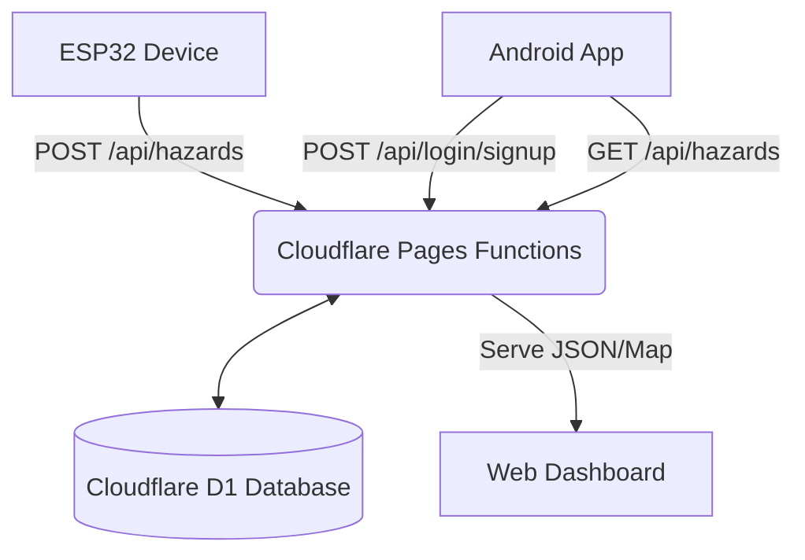

<div align="center">
  
  <h1>🛣️ RoadSense</h1>
  <p><b>Crowd-sourced road hazard reporting for Indian cities.</b></p>
  
  <p>
    <a href="https://github.com/priencelucifer/ROADSENSE/stargazers">
      
    </a>
    <a href="https://github.com/priencelucifer/ROADSENSE/issues">
      
    </a>
    
  </p>

  <p>Hazards like potholes and speed breakers are submitted by ESP32 IoT devices and Android users, stored in a Cloudflare D1 database at the edge, and visualized as a live heatmap on a web dashboard and an Android map.</p>
</div>

---

## 📑 Table of Contents
- [🌟 Key Features](#-key-features)
- [🛠️ Tech Stack](#️-tech-stack)
- [📂 Repository Architecture](#-repository-architecture)
- [🚀 Getting Started](#-getting-started)
- [🔌 API Reference](#-api-reference)
- [📝 Important Notes](#-important-notes)

---

## 🌟 Key Features

- **📡 IoT Integration:** Seamlessly receive hazard data from ESP32 devices on vehicles.
- **📱 Android App:** Empower users to view hazards on an interactive map and report new ones.
- **🗺️ Live Heatmap:** Web dashboard powered by Mapbox GL JS for real-time hazard visualization.
- **⚡ Edge Computing:** Lightning-fast APIs using Cloudflare Pages Functions and D1 Database.

> **Status:** Active &nbsp;·&nbsp; **Coverage:** Guwahati, Delhi

---

## 🛠️ Tech Stack

<div align="center">
  
  
  
  
  
</div>

---

## 📂 Repository Architecture

This repository is a sanitized merge of two previously private projects.

| Path | Description | Technologies |
| :--- | :--- | :--- |
| 📁 [`backend/`](./backend) | Edge API, web dashboard, ESP32 simulator | Cloudflare Pages, Functions, D1, Mapbox GL JS |
| 📁 [`app/`](./app) | Native Android client application | Kotlin, Mapbox Maps SDK v11, OkHttp, Coroutines |

### System Diagram



---

## 🚀 Getting Started

To run this project locally, you will need a [Mapbox](https://account.mapbox.com/) account (public + secret tokens) and a [Cloudflare](https://dash.cloudflare.com/) account.

### 🌐 Backend Setup

```bash
cd backend
npm i -g wrangler

# 1. Create the D1 database, then paste the database_id into wrangler.toml
wrangler d1 create roadsense-db-v2

# 2. Apply schema (and optional seed)
wrangler d1 execute roadsense-db-v2 --file=./schema.sql
wrangler d1 execute roadsense-db-v2 --file=./add_delhi.sql

# 3. Set the shared secret used by the ESP32 simulator
wrangler pages secret put API_SECRET_KEY

# 4. Replace YOUR_MAPBOX_PUBLIC_TOKEN_HERE in public/index.html with your pk.* token
wrangler pages deploy public
```

### 💻 ESP32 Simulator

Test the ingestion API without physical hardware:

```bash
cd backend
API_SECRET_KEY=your-secret-here node test_esp32.js
```

### 📱 Android App Setup

1. Create `app/local.properties` with your Mapbox **secret** download token:
   ```properties
   sdk.dir=/path/to/your/Android/Sdk
   MAPBOX_DOWNLOADS_TOKEN=sk.your_mapbox_secret_token_here
   ```
2. Open `app/app/src/main/res/values/strings.xml` and replace `YOUR_MAPBOX_SECRET_TOKEN_HERE` with your runtime Mapbox secret token.
3. If your backend is not deployed at `roadsense-app-v2.pages.dev`, update the base URLs in:
   - `MainActivity.kt`
   - `LoginActivity.kt`
   - `SignupActivity.kt`
4. Open the `app/` directory in Android Studio (JDK 17, Android SDK 34) and run the application.

---

## 🔌 API Reference

| Method | Endpoint | Auth Required | Description |
| :---: | :--- | :--- | :--- |
| `GET` | `/api/hazards` | None | Retrieve hazard list for map plotting. |
| `POST` | `/api/hazards` | `secret_key` | Submit a new hazard (used by ESP32). |
| `POST` | `/api/login` | `password` | Authenticate Android user. |
| `POST` | `/api/signup` | `password` | Register new Android user. |
| `GET` | `/api/search` | None | Forward geocoding / place search. |

---

## 📝 Important Notes

- **Security:** Every credential in this repository is a placeholder. **Supply your own keys and never commit real tokens.**
- **History:** This repository is a sanitized merge of previously internal projects. Original commit history is not preserved.
- **Forking:** The Android package is `com.ricky.roadsense`. Remember to rename it if you are forking this for production use.

<div align="center">
  Made with ❤️ for safer roads.
</div>