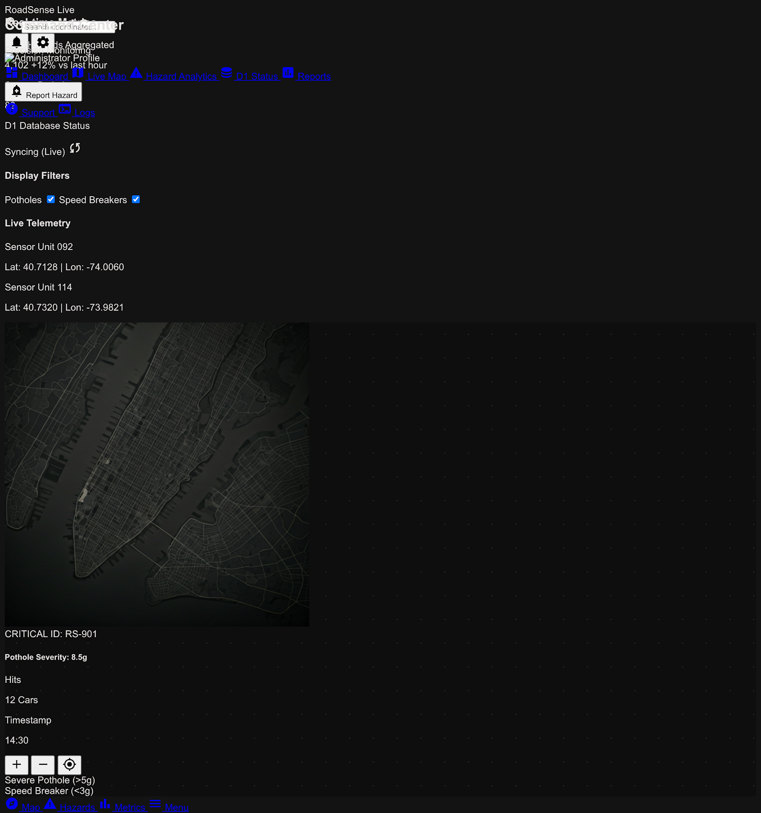

<div align="center">


# RoadSense

**Crowd-sourced road hazard reporting for Indian cities.**

Live heatmap of potholes, speed breakers and other road hazards — collected from ESP32 IoT devices and Android users, served from the edge.

<p>
  
  
  
  
</p>

<sub>Coverage: Guwahati · Delhi · expanding</sub>

</div>

---

## Preview

<div align="center">



</div>

---

## What's in this repo

This is the **public, sanitized merge** of two previously private repositories.

| Subdirectory | What it is | Stack |
|---|---|---|
| **[`backend/`](./backend)** | Edge API, web dashboard, ESP32 simulator | Cloudflare Pages · Pages Functions · D1 (SQLite) · Mapbox GL JS |
| **[`app/`](./app)** | Android client | Kotlin · Mapbox Maps SDK v11 · OkHttp · Coroutines |

---

## Architecture

```
         ┌───────────────┐                ┌───────────────┐
         │  ESP32 device │                │  Android app  │
         │  (simulator)  │                │     (app/)    │
         └───────┬───────┘                └───────┬───────┘
                 │ POST /api/hazards              │  POST /api/login
                 │   (secret_key)                 │  POST /api/signup
                 │                                │  GET  /api/hazards
                 ▼                                ▼
         ┌──────────────────────────────────────────────────┐
         │   Cloudflare Pages Functions  (backend/functions)│
         │              + D1 database (schema.sql)          │
         └──────────────────────────┬───────────────────────┘
                                    │
                                    ▼
                          ┌──────────────────┐
                          │  Web dashboard   │
                          │ (backend/public) │
                          └──────────────────┘
```

---

## Quick start

> Prerequisites: a [Mapbox](https://account.mapbox.com/) account (public + secret tokens) and a [Cloudflare](https://dash.cloudflare.com/) account.

### Backend — Cloudflare Pages + D1

```bash
cd backend
npm i -g wrangler                                  # if not already installed

# 1. create a D1 database, paste the database_id into wrangler.toml
wrangler d1 create roadsense-db-v2

# 2. apply schema (and optional seed)
wrangler d1 execute roadsense-db-v2 --file=./schema.sql
wrangler d1 execute roadsense-db-v2 --file=./add_delhi.sql

# 3. set the ESP32 shared secret
wrangler pages secret put API_SECRET_KEY

# 4. drop your Mapbox PUBLIC token into public/index.html
#    (replace YOUR_MAPBOX_PUBLIC_TOKEN_HERE)

# 5. deploy
wrangler pages deploy public
```

### ESP32 simulator

```bash
cd backend
API_SECRET_KEY=your-secret-here node test_esp32.js
```

### Android app

<details>
<summary><strong>Step-by-step</strong> (click to expand)</summary>

Prerequisites: Android Studio, JDK 17, Android SDK 34.

1. Create `app/local.properties`:
   ```properties
   sdk.dir=/path/to/your/Android/Sdk
   MAPBOX_DOWNLOADS_TOKEN=sk.your_mapbox_secret_token_here
   ```
   The `MAPBOX_DOWNLOADS_TOKEN` is required to download the Mapbox Maven artifacts at build time.

2. Edit `app/app/src/main/res/values/strings.xml` and replace `YOUR_MAPBOX_SECRET_TOKEN_HERE` with your Mapbox **secret** (`sk.…`) token used by the SDK at runtime.

3. If your backend is deployed somewhere other than `roadsense-app-v2.pages.dev`, update the URLs in `app/app/src/main/java/com/ricky/roadsense/`:
   - `MainActivity.kt` — hazards endpoints
   - `LoginActivity.kt` — login endpoint
   - `SignupActivity.kt` — signup endpoint

4. Open the project in Android Studio and run.

</details>

---

## API

All endpoints are served from `https://<your-pages-deployment>/api/`.

| Method | Path | Auth | Purpose |
|---|---|---|---|
| `GET` | `/api/hazards` | — | List hazards (used by web map + Android) |
| `POST` | `/api/hazards` | `secret_key` in body | Submit a new hazard (ESP32) |
| `POST` | `/api/login` | password in body | User login |
| `POST` | `/api/signup` | password in body | User signup |
| `GET` | `/api/search` | — | Location / place search |

---

## Repository layout

```
.
├── backend/                  Cloudflare Pages + Functions + D1 + web dashboard
│   ├── functions/api/          Pages Functions (hazards, search, login, signup)
│   ├── public/                 Static dashboard (Mapbox GL JS)
│   ├── schema.sql              D1 schema
│   ├── add_delhi.sql           Optional seed data
│   ├── test_esp32.js           ESP32 device simulator
│   └── wrangler.toml           Cloudflare config
│
└── app/                      Android app (Kotlin)
    ├── app/                    Module sources
    ├── build.gradle.kts
    └── settings.gradle.kts
```

---

## Notes for contributors

- **Credentials.** Every token in this repo is a placeholder. Supply your own via the steps above; never commit real tokens.
- **History.** This is a sanitized merge of two private repos, committed fresh — original commit history is not preserved.
- **Naming.** The Android package is `com.ricky.roadsense`. Rename if you fork for production use.

---

<div align="center">
<sub>Built with Mapbox · Cloudflare · Kotlin · ESP32</sub>
</div>
